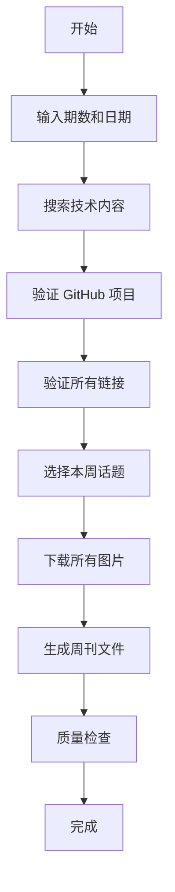

# Copilot Skills 使用指南

这个目录包含了用于自动化生成博客内容的 GitHub Copilot Skills，遵循 [Agent Skills 规范](https://agentskills.io/specification)。

## 📁 目录结构

```
skills/
├── weekly/           # 攻城狮周刊生成相关 skills
│   ├── generate_weekly.md        # 主流程：生成完整周刊
│   ├── search_tech_content.md    # 搜索技术内容
│   ├── fetch_github_info.md      # 获取 GitHub 项目信息
│   ├── verify_links.md           # 验证链接有效性
│   ├── download_images.md        # 下载和管理图片
│   ├── SKILL.md                  # Skills 总览
│   ├── scripts/                  # 辅助脚本
│   │   ├── download_image.py             # 下载单张图片
│   │   ├── download_weekly_images.py     # 批量下载图片
│   │   ├── requirements.txt              # Python 依赖
│   │   └── README.md                     # 脚本使用说明
│   └── references/               # 参考示例
│       └── week_demo.md                  # 周刊示例
└── daily/            # 深度文章创作相关 skills
    ├── write_deep_article.md            # 撰写深度思考文章
    ├── verify_content_authenticity.md   # 验证内容真实性
    └── SKILL.md                         # Skills 总览
```

## 🚀 快速开始

### 1. 生成攻城狮周刊

使用 `@workspace #file:generate_weekly.md` 来生成周刊。

#### 示例：生成第 3 期周刊（2026 年）

```
@workspace #file:generate_weekly.md 请生成第 3 期攻城狮周刊
- week_number: 3
- start_date: 2026-01-11
- end_date: 2026-01-17
```

这将自动：
1. 搜索本周的技术动态、博客文章、工具和项目
2. 验证所有 GitHub 项目的真实 Star 数
3. 验证所有链接的有效性
4. 下载相关图片到周刊目录
5. 生成完整的周刊文件：`output/weekly/2026/weekly-3/index.md`

#### 输出结构

```
output/weekly/2026/weekly-3/
├── index.md           # 周刊内容（带 Hugo Front Matter）
├── featured.png       # 封面图（Hugo 自动识别）
├── news-1.png         # 行业动态图片
├── blog-1.jpg         # 深度阅读图片
├── tool-1.png         # 效率工具图片
├── ai-1.png           # AI 项目图片
└── resource-1.jpg     # 学习资源图片
```

### 其他年份示例

生成 2027 年第 1 期：
```
@workspace #file:generate_weekly.md 请生成第 1 期攻城狮周刊
- week_number: 1
- start_date: 2027-01-02
- end_date: 2027-01-08
```

输出：`output/weekly/2027/weekly-1/index.md`

### 2. 撰写深度思考文章

使用 `@workspace #file:write_deep_article.md` 来创作微信公众号深度文章。

#### 示例：基于热点事件创作

```
@workspace #file:write_deep_article.md
请写一篇关于 OpenAI GPT-5 发布的深度分析文章
- topic: OpenAI GPT-5 发布解读
- article_type: trend_analysis
- target_length: 2500
```

这将自动：
1. 收集 15+ 个相关信息来源（官方、媒体、学术、社区）
2. 交叉验证所有事实、数据和引用
3. 撰写有深度、去 AI 化的原创文章
4. 生成验证报告和参考资料清单
5. 输出文章文件：`output/daily/2026-01-31-openai-gpt5-analysis.md`

#### 文章类型

- `trend_analysis`: 行业趋势分析
- `case_study`: 案例深度解析
- `tech_insight`: 技术洞察与思考
- `comparison`: 对比分析
- `reflection`: 反思与展望

#### 更多示例

技术洞察：
```
@workspace #file:write_deep_article.md
写一篇关于 AI 编程助手实际影响的思考文章
- topic: AI 编程助手的真实影响
- article_type: tech_insight
```

案例分析：
```
@workspace #file:write_deep_article.md
分析 Netflix 如何使用 AI 优化推荐系统
- topic: Netflix AI 推荐系统
- article_type: case_study
```

## 📝 单独使用各个 Skill

### 周刊相关

#### 搜索技术内容

```
@workspace #file:search_tech_content.md 搜索最近 7 天的 DevOps 博客文章
```

#### 获取 GitHub 项目信息

```
@workspace #file:fetch_github_info.md 获取 kubernetes/kubernetes 的项目信息
```

#### 验证链接

```
@workspace #file:verify_links.md 验证以下链接的有效性：
- https://example.com/article1
- https://github.com/user/repo
```

#### 下载图片

```
@workspace #file:download_images.md 下载图片到 output/weekly/2026/weekly-3/
```

### 文章创作相关

#### 验证内容真实性

```
@workspace #file:verify_content_authenticity.md
验证文章中的所有事实和数据
```

这将自动：
- 验证所有链接的可访问性
- 确认发布日期准确性
- 评估来源可信度（⭐ 1-5 星）
- 进行多来源交叉验证
- 生成详细的验证报告

## 🎯 工作流程

完整的周刊生成流程：



## 📋 前置要求

- GitHub Copilot 订阅
- VS Code with GitHub Copilot extension
- 能够访问互联网（用于搜索和下载）

## 💡 使用技巧

1. **灵活调整时间范围**：如果最近 7 天内容不足，可以扩展到 2 周
2. **手动筛选内容**：生成后可以手动调整内容顺序和筛选质量
3. **自定义话题**：可以根据当前热点自行修改本周话题
4. **图片优化**：如果自动下载的图片不合适，可以手动替换
5. **分步执行**：如果一次性生成有问题，可以分步使用各个 skill

## 🔍 常见问题

**Q: 生成的周刊放在哪里？**
A: 根据年份自动放置，格式为 `content/posts/{YEAR}/weekly-{NUMBER}/index.md`

**Q: 封面图为什么必须是 featured.png？**
A: Hugo 的 Blowfish 主题会自动识别 `featured.png` 作为文章封面图

**Q: 可以修改生成的内容吗？**
A: 当然可以！生成的内容是建议性的，你可以根据需要进行编辑和调整

**Q: 如果某个 GitHub 项目无法访问怎么办？**
A: Skill 会自动跳过无法访问的项目，并在生成时提示

**Q: 生成的周刊包含哪些章节？**
A: 包括：本周封面、本周话题、行业动态、深度阅读、效率工具、AI 相关、学习资源、精彩摘要、行业观点

## 📚 更多信息

- [Hugo 文档](https://gohugo.io/documentation/)
- [Blowfish 主题文档](https://blowfish.page/)
- [博客项目主页](https://github.com/shenxianpeng/blog)
